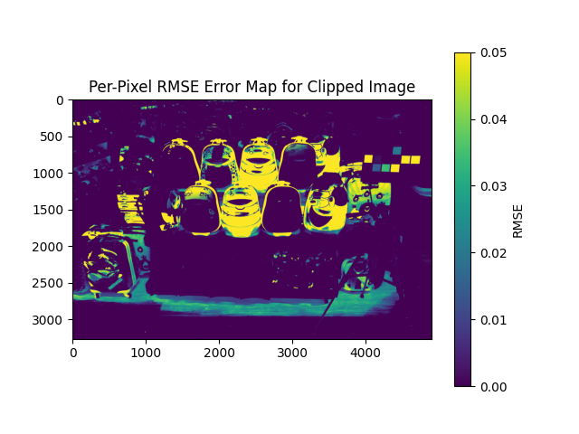
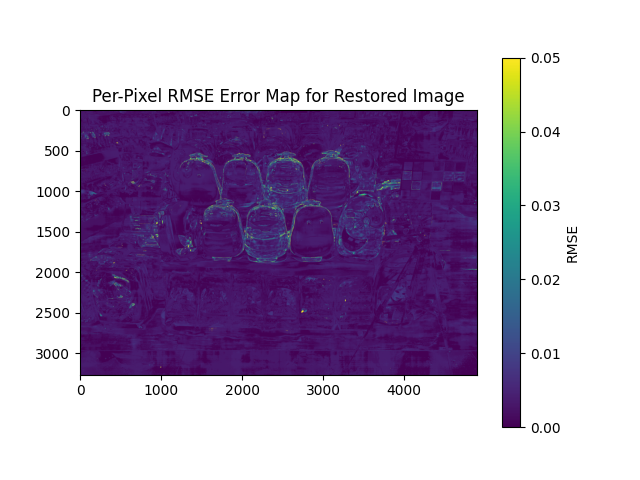
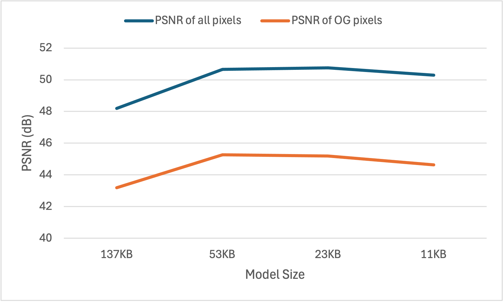
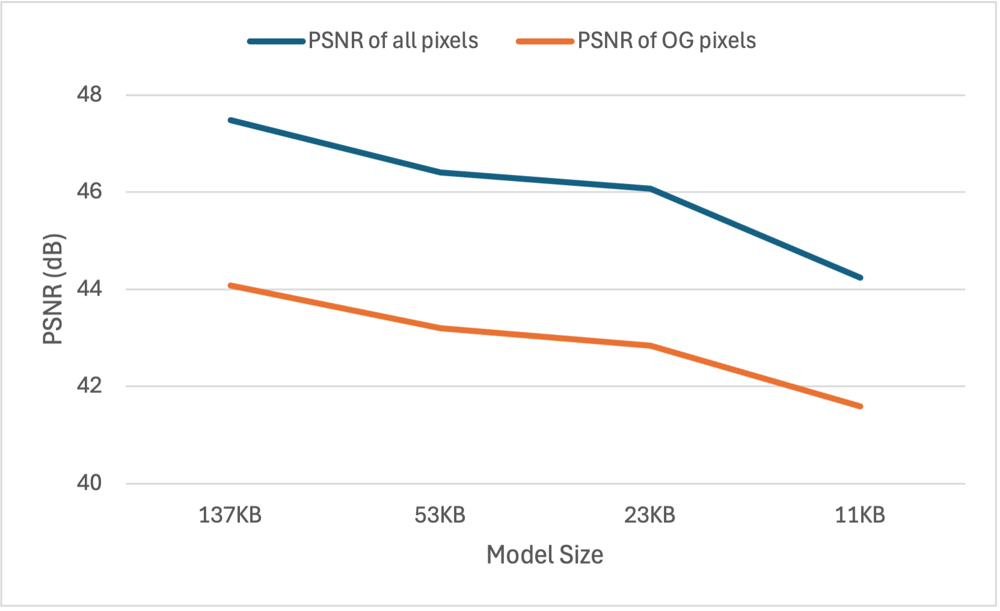

# [EECS6322] Reproducibility Challenge: GamutMLP
This repository contains our attempt of reproducing [GamutMLP: A Lightweight MLP for Color Loss Recovery](https://gamut-mlp.github.io/). 

The paper targets the problem of colour loss during colour space conversion between ProPhoto RGB (ProPhoto) and standard RGB (sRGB) colour spaces.
When converting a ProPhoto image to sRGB, out-of-gamut pixels are **clipped** to fit in the sRGB colour space. When converting the sRGB image back to ProPhoto, the **clipped** pixels remain clipped, resulting in lost colour fidelity.

> 🖼️ Background: ProPhoto is a wide-gamut colour space that covers 90% of visible colours and is used by modern cameras and image-editing software.
> sRGB is a small-gamut colour space that covers 30% of visible colours and is commonly used to store images and display on monitors.

The paper proposes a two step framework to restore the colours: gamut reduction and gamut expansion.
> **Gamut Reduction (ProPhoto to sRGB)**: While converting the ProPhoto image to sRGB, they train a lightweight MLP model, called *GamutMLP*, to predict the **residual** values. The residual values are added to the clipped ProPhoto image to restore the original ProPhoto colour values.
The model is small enough that it can be embedded into the sRGB image.

> **Gamut Expansion (sRGB to ProPhoto)**: To restore the original ProPhoto colours, the GamutMLP model is extracted from the sRGB image. The model is used to retrieve all the residual values which are added to restore the ProPhoto image.


## Environment
To setup the Conda environment, please run:

```
conda env create -f environment.yaml
```

## Datasets
We use the dataset prepared by the paper here: [GamutMLP's dataset page](https://github.com/hminle/gamut-mlp#dataset)

## Models
The GamutMLP variants (11KB, 23KB, 53KB, and 137KB) are defined in the `model.py` file. 
The model contains three linear layers: two ReLU layers (number of hidden features specified below) and an output layer which outputs three residual values (R, G, B).
We implemented everything using the Pytorch framework.
| Model Size | Hidden Features |
|------------|-----------------|
| 11KB       | 16              |
| 23KB       | 32              |
| 53KB       | 64              |
| 137KB      | 128             |

## Training
The `train.py` file handles training the models.
The  `pretrain.py` file handles pre-training the models.

## Experiments
We provide an `experiment_config.py` file where you can specify which model to run. 
The `experiments.py` file will handle the models based on the configs file. You will need to modify the config file if you would like to run other models.


To run the experiments, please run:
```
python src/experiments.py
```
> 📝 After running the experiments, the RMSE, PSNR, and optimization time metrics are stored in the `logs` folder.

## Pre-trained Models

You can find the meta-GamutMLP models for the 23KB and 53KB models under the `pretrained_weights` folder.
The models were pre-trained on 2000 training images using 1 meta-epoch.
As specified in the paper, the meta MLP models optimize each image using 10,000 iterations and use the SGD optimizer with learning rate 1e-2.

## Results
<figure style="text-align: center;">
  <div style="display: flex; justify-content: center; gap: 10px;">
    
    
  </div>
  <figcaption style="margin-top: 8px;">Figure 1: Comparison of RMSE maps before (left) and after (right) our restoration.</figcaption>
</figure>
For the most part, we were able to reimplement all the steps from scratch and obtain results. 
However, we were not successful in reproducing the results in the paper.
Please refer to the project report for our discussion on the results and possible reasons why we could not achieve their results.
We show the results from our two attempts below:

### Attempt 1

**Table 1:** Average results computed against 5 ProPhoto ground-truth images. The RMSE and PSNR are calculated for the whole image and out-of-gamut (OG) pixels.
| # | Method                           | Metadata | RMSE  | RMSE OG | PSNR  | PSNR OG | Optim Time     |
|---|----------------------------------|----------|-------|---------|-------|---------|----------------|
| 1 | MLP (53KB) + enc.                | 53 KB    | 0.0049| 0.0079  | 50.66 | 45.27   | 1316.26 sec    |
| 2 | MLP (23KB) + enc.                | 23 KB    | 0.0043| 0.0070  | 50.75 | 45.18   | 1267.55 sec    |
| 3 | MLP (53KB) + enc. + meta init.   | 53 KB    | 0.0098| 0.0139  | 44.08 | 40.12   | 175.42 sec     |
| 4 | MLP (23KB) + enc. + meta init.   | 23 KB    | 0.0051| 0.0082  | 48.58 | 43.97   | 173.21 sec     |

**Figure 8:** PSNR vs. model size comparison.


### Attempt 2
**Table 1:** Average results computed against 5 ProPhoto ground-truth images. The RMSE and PSNR are calculated for the whole image and out-of-gamut (OG) pixels.
| # | Method                           | Metadata | RMSE  | RMSE OG | PSNR  | PSNR OG | Optim Time     |
|---|----------------------------------|----------|-------|---------|-------|---------|----------------|
| 1 | MLP (53KB) + enc.                | 53 KB    | 0.0084| 0.0109  | 46.41 | 43.20   | 146.78 sec     |
| 2 | MLP (23KB) + enc.                | 23 KB    | 0.0081| 0.0108  | 46.07 | 42.84   | 81.37 sec      |
| 3 | MLP (53KB) + enc. + meta init.   | 53 KB    | 0.0074| 0.0100  | 46.34 | 43.29   | 19.77 sec      |
| 4 | MLP (23KB) + enc. + meta init.   | 23 KB    | 0.0081| 0.0106  | 45.12 | 42.43   | 11.01 sec      |

**Figure 8:** PSNR vs. model size comparison.

